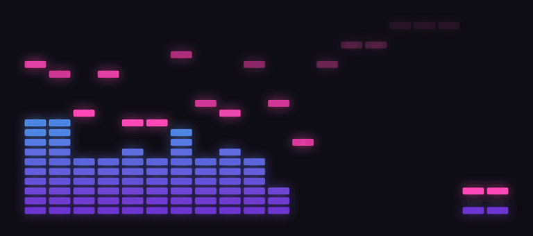

# RetroWave



A retro LED spectrum analyzer for your Mac. It listens to whatever your Mac
is playing and draws a 20-band LED-style display in a floating transparent
window, with twenty colour modes, peak hold, beat flash, and a sweep
animation when the music stops.

Requires macOS 14.2 or later. Universal binary, signed and notarised.

## Install

One line, which adds the tap and installs in a single step:

```sh
brew install --cask craigday/retrowave/retrowave
```

Or step by step. Recent Homebrew versions treat third-party taps as
untrusted until you say otherwise, so trust the tap once after adding it:

```sh
brew tap craigday/retrowave
brew trust craigday/retrowave
brew install --cask retrowave
```

On older Homebrew versions without the `trust` command, skip that line:

```sh
brew tap craigday/retrowave
brew install --cask retrowave
```

If you use the one-line form on a recent Homebrew, it prompts you to run
`brew trust` and then continues.

On first launch macOS asks to allow system audio recording; RetroWave
records nothing, it only reads the audio to draw the display.

Without Homebrew: download `RetroWave-<version>.zip` from the
[releases page](https://github.com/craigday/homebrew-retrowave/releases)
and drag the app into `/Applications`.

## Upgrade and uninstall

```sh
brew upgrade --cask retrowave
brew uninstall --cask retrowave
```

## Support

Found a bug or want a feature? Open an
[issue](https://github.com/craigday/homebrew-retrowave/issues). Please include
your macOS version and the RetroWave version shown at the top of its menu.

## About this repository

This is the Homebrew tap and release host for RetroWave. The source code is
not published. Releases are built, signed, and notarised by a CI pipeline
that also updates `Casks/retrowave.rb` with each version.

© 2026 Craig Day. All rights reserved. RetroWave is free to use; the source is
not published under an open-source licence.
